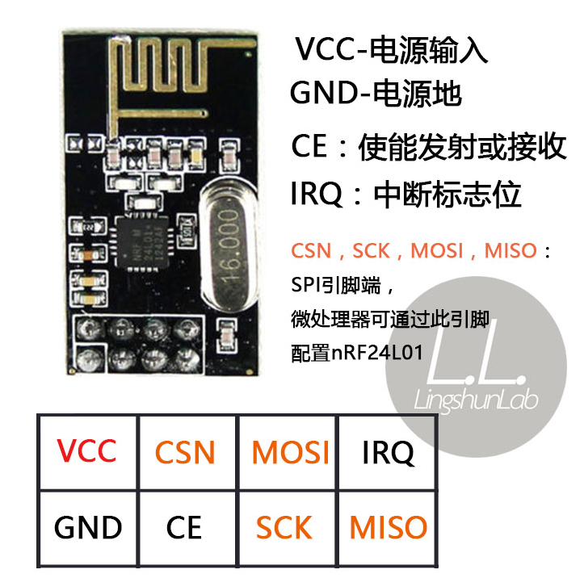

# NRF24L01

这是一个使用 NRF24L01 SPI 2.4 GHz 无线通信的示例。

## 引脚

### NRF24L01

- VCC: VCC
- GND: GND
- CSN: PB7
- CE: PB6
- MOSI: PB5
- SCK: PB3
- MISO: PB4

## 执行指令

```shell
cargo rp spi_nrf24l01
```

## 学习目标

- 了解 NRF24L01 crate

## 接线图


