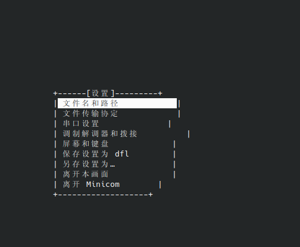
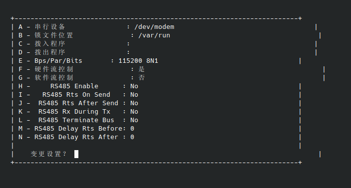
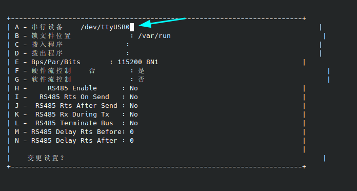
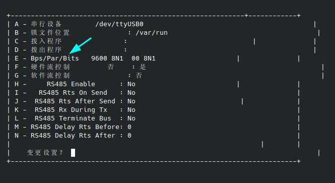
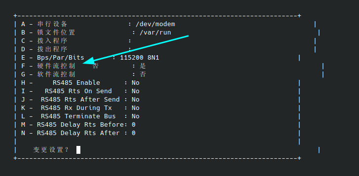
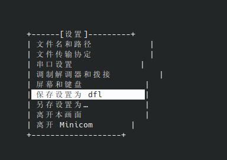
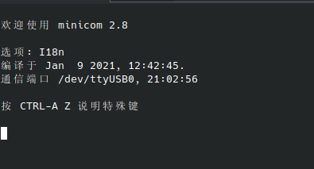

# Minicom 使用文档

## 打开工具配置界面

```shell
sudo minicom -s
```



## 查看串口设备

- 确认串口
  - 插拔一下串口端口，看哪一个是新增的，新增的那个设备大概率就是当前的串口了。

```shell
ls /dev/ttyUSB*
```

- 查看这个串口设备输出：

```shell
cat /dev/ttyUSB0
```

- 对这个设备输入：

```shell
echo test > ttyUSB0
```

## 选择串口设置



- 按键盘“A”输入串口的映射文件名



- 按键盘“E”可以修改波特率
  

- 按键盘“F”把硬件流关闭，否则 minicom 可能无法接收键盘输入

  

## 保存默认配置

保存后选择退出。


## 直接编辑配置文件配置

- 打开编辑文件

```shell
sudo vim /etc/minirc.dfl
```

- 输入以下内容

```shell
# 电脑产生的文件 - 使用“minicom -s”以变更参数。
pu port             /dev/ttyUSB0
pu baudrate         9600
pu bits             8
pu parity           N
pu stopbits         1
pu rtscts           No
```

## 打开串口

```shell
sudo minicom

# 指定编码打开
sudo minicom -R utf8
```



## 常用指令

- 退出 minicom：crtl+A->x
- 在 minicom 中打开配置页面：crtl+A->o
- 在 minicom 中输入回车和换行：
  - 键入 ctrl+M，即可输入 0D 回车符（\r）
  - 键入 ctrl+J，即可输入 0A 换行符（\n）
- 快速打开串口：minicom -D /dev/ttyUSB0
